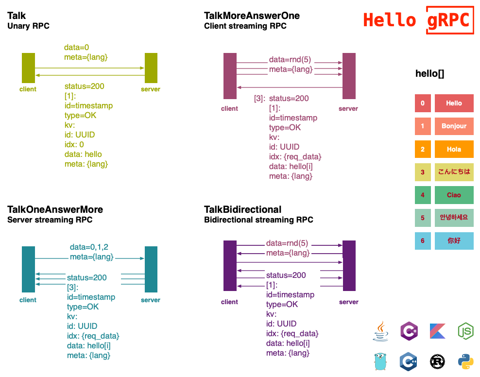

## Hello gRPC

### 1 Diagram

client [end of stream (EOS)]->[Length-Prefixed Message][]->[Headers] server

client [Headers]<-[Length-Prefixed Message][]<-[Trailers] server

### 2 Proto3
- [proto](grpc/proto)

### 3 Features

| | | [java](grpc/hello-grpc-java) | [go](grpc/hello-grpc-go) | [nodejs](grpc/hello-grpc-) | [python](grpc/hello-grpc-python) | [rust](grpc/hello-grpc-rust) | [c++](grpc/hello-grpc-cpp) | [kotlin](grpc/hello-grpc-kotlin) | [c#](grpc/hello-grpc-csharp) |
| ------ | ------ | -------- | ---- | ------ | ------ | ---- | ---- | ------ | ------ |
| 4 MODELS | Array | :apple: | :apple: | :apple: | :apple: | :apple: | :apple: | :apple: | :green_apple: |
| | Sleep | :apple: | :apple: | :apple: | :apple: | :apple: | :apple: | :apple: | :green_apple: |
| | Random | :apple: | :apple: | :apple: | :apple: | :apple: | :apple: | :apple: | :green_apple: |
| | Timestamp | :apple: | :apple: | :apple: | :apple: | :apple: | :apple: | :apple: | :green_apple: |
| | UUID | :apple: | :apple: | :apple: | :apple: | :apple: | :green_apple: | :apple: | :green_apple: |
| | Env | :apple: | :apple: | :apple: | :apple: | :apple: | :green_apple: | :green_apple: | :green_apple: |
| Header | | :apple: | :apple: | :apple: | :apple: | :apple: | :green_apple: | :green_apple: | :green_apple: |
| TLS | | :apple: | :apple: | :apple: | :apple: | :green_apple: | :green_apple: | :green_apple: | :green_apple: |
| Log | | :apple: | :apple: | :apple: | :apple: | :apple: | :green_apple: | :green_apple: | :green_apple: |
| Proxy | | :apple: | :apple: | :apple: | :apple: | :apple: | :green_apple: | :green_apple: | :green_apple: |
| Docker | | :apple: | :apple: | :apple: | :apple: | :apple: | :green_apple: | :green_apple: | :green_apple: |

### 4 Cross Access Test
- [cross](cross)

### 5 Propagate Test
- [propagate](propagate)

### 6 ServiceMesh
- [kube](kube)
- [mesh](mesh)
- [tracing](tracing)

### 7 Http2gRPC
- [transcoder](transcoder)