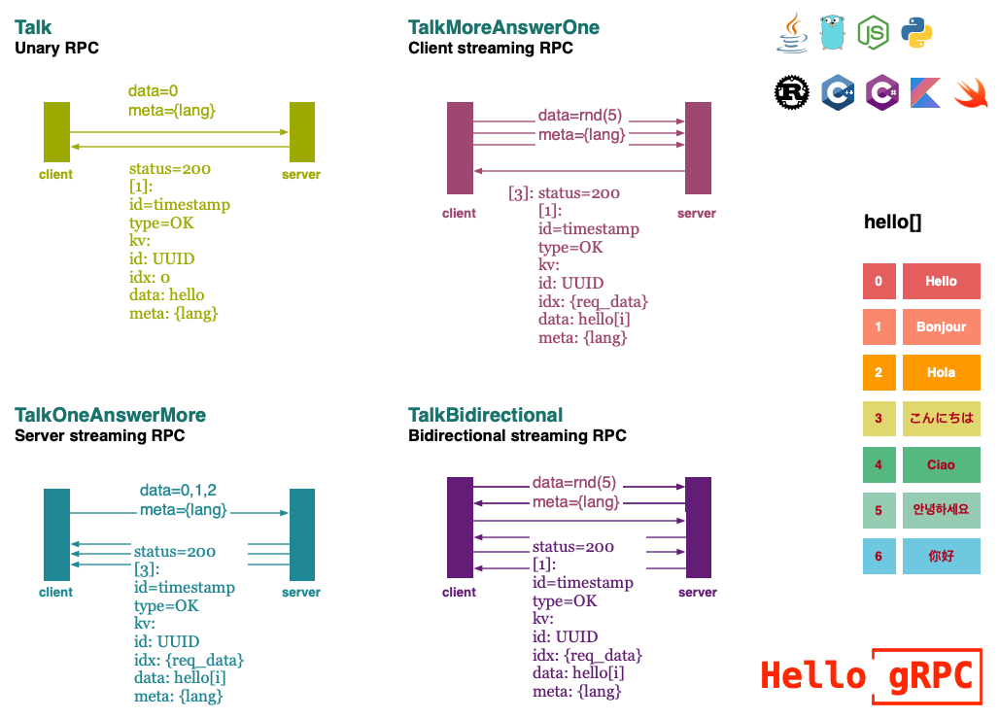

# Hello gRPC

Simple server and client examples showcasing gRPC features(including proxy and propagate, running in containers and kubernetes) with 
- Java
- Go
- NodeJs
- Python
- Rust
- C++
- C#
- Kotlin
- Swift

## :coffee: What is ... >

### 1 Diagram



`client [end of stream (EOS)]->[Length-Prefixed Message][]->[Headers] server`

`client [Headers]<-[Length-Prefixed Message][]<-[Trailers] server`

### 2 Proto3

- [proto](grpc/proto)

### 3 Features

|  | [java](grpc/hello-grpc-java) | [go](grpc/hello-grpc-go) | [nodejs](grpc/hello-grpc-nodejs) | [python](grpc/hello-grpc-python) | [rust](grpc/hello-grpc-rust) | [c++](grpc/hello-grpc-cpp) | [c#](grpc/hello-grpc-csharp) | [kotlin](grpc/hello-grpc-kotlin)  | [swift](grpc/hello-grpc-swift) |
| :---- | :---- | :---- | :---- | :---- | :---- | :---- | :---- | :---- | :---- |
| 4 MODELS | :apple:  | :apple:  | :apple:  | :apple:  | :apple:  | :apple:  | :apple:  | :apple: |  |
| build tools  | maven  | mod  | npm  | pip  | cargo  | cmake  | gradle | nuget |  |
| Array/Link/Map | :apple:  | :apple:  | :apple:  | :apple:  | :apple:  | :apple:  | :apple:  | :apple: |  |
| Sleep  | :apple:  | :apple:  | :apple:  | :apple:  | :apple:  | :apple:  | :apple:  | :apple: |  |
| Random | :apple:  | :apple:  | :apple:  | :apple:  | :apple:  | :apple:  | :apple:  | :apple: |  |
| Timestamp  | :apple:  | :apple:  | :apple:  | :apple:  | :apple:  | :apple:  | :apple:  | :apple: |  |
| UUID | :apple:  | :apple:  | :apple:  | :apple:  | :apple:  | :green_apple:  | :apple:  | :apple: |  |
| UT | [junit5](https://junit.org/junit5/) | <testing> |  | <unittest> | [mocha](https://www.npmjs.com/package/mocha) |  |  | |
| LOG  | [log4j2](https://logging.apache.org/log4j) | [logrus](github.com/sirupsen/logrus) | [winston](https://www.npmjs.com/package/winston) | <logging>  | [log4rs](https://docs.rs/log4rs) | [glog](https://github.com/google/glog) | [log4net](https://logging.apache.org/log) |  [log4j2](https://logging.apache.org/log4j)  ||
| Env  | :apple:  | :apple:  | :apple:  | :apple:  | :apple:  | :apple:  | :apple:  | :apple: |  |
| Header | :apple:  | :apple:  | :apple:  | :apple:  | :apple:  | :apple:  | :apple:  | :apple: |  |
| TLS  | :apple:  | :apple:  | 🥑  | :apple:  | :apple:  | :apple:  | :apple:  | :apple: |  |
| Proxy  | :apple:  | :apple:  | :apple:  | :apple:  | :apple:  | :apple:  | :apple:  | :apple: |  |
| Docker | :apple:  | :apple:  | :apple:  | :apple:  | :apple:  | :apple:  | :apple:  | :apple: |  |
| IDE  | IDEA | GoLand | WebStorm | PyCharm  | CLion  | CLion  | Rider  | IDEA  | AppCode  |

> - :apple: done
> - :green_apple: unimplemented
> - 🥑 known issues

### 4 Propagate

- [propagate](grpc/propagate)

### 5 Service Mesh

> [build and publish docker image](grpc/docker/README.md)

- [running on kube](kube)
- [running above service mesh](mesh)
- [support open tracing](tracing)

### 6 Http2gRPC

- [transcoder](transcoder)

## :coffee: How to use

### 1 Envs

- `GRPC_SERVER`: grpc server host on client side.
- `GRPC_SERVER_PORT`: grpc server port on client side.
- `GRPC_HELLO_BACKEND`: next grpc server host on server side.
- `GRPC_HELLO_BACKEND_PORT`:next grpc server port on server side.
- `GRPC_HELLO_SECURE`: set it as `Y` when you want to use `TLS` on both sides.

### 2 Containers

Running in containers
`client(kotlin)` -`[tls]:8881`-> `server1(java)` -`[tls]:8882`-> `server2(golang)` -`[tls]:8883`-> `server3(rust)`

```bash
# server3(golang):8883
docker run --rm --name grpc_server_go -d \
 -p 8883:8883 \
 -e GRPC_SERVER_PORT=8883 \
 feuyeux/grpc_server_rust:1.0.0

# server2(rust):8882
docker run --rm --name grpc_server_rust -d \
 -p 8882:8882 \
 -e GRPC_SERVER_PORT=8882 \
 -e GRPC_HELLO_BACKEND=$(ipconfig getifaddr en0) \
 -e GRPC_HELLO_BACKEND_PORT=8883 \
 feuyeux/grpc_server_go:1.0.0

# server1(java):8881
docker run --rm --name grpc_server_java -d \
 -p 8881:8881 \
 -e GRPC_SERVER_PORT=8881 \
 -e GRPC_HELLO_BACKEND=$(ipconfig getifaddr en0) \
 -e GRPC_HELLO_BACKEND_PORT=8882 \
 feuyeux/grpc_server_java:1.0.0

# client(kotlin)
docker run --rm --name grpc_client_kotlin \
 -e GRPC_SERVER=$(ipconfig getifaddr en0) \
 -e GRPC_SERVER_PORT=8881 \
 feuyeux/grpc_client_kotlin:1.0.0
```

### 3 Logs

Enable gRpc Debugging

```bash
export GRPC_VERBOSITY=DEBUG
export GRPC_TRACE=all
```

## :coffee: Recommend

<https://github.com/grpc-ecosystem/awesome-grpc>
