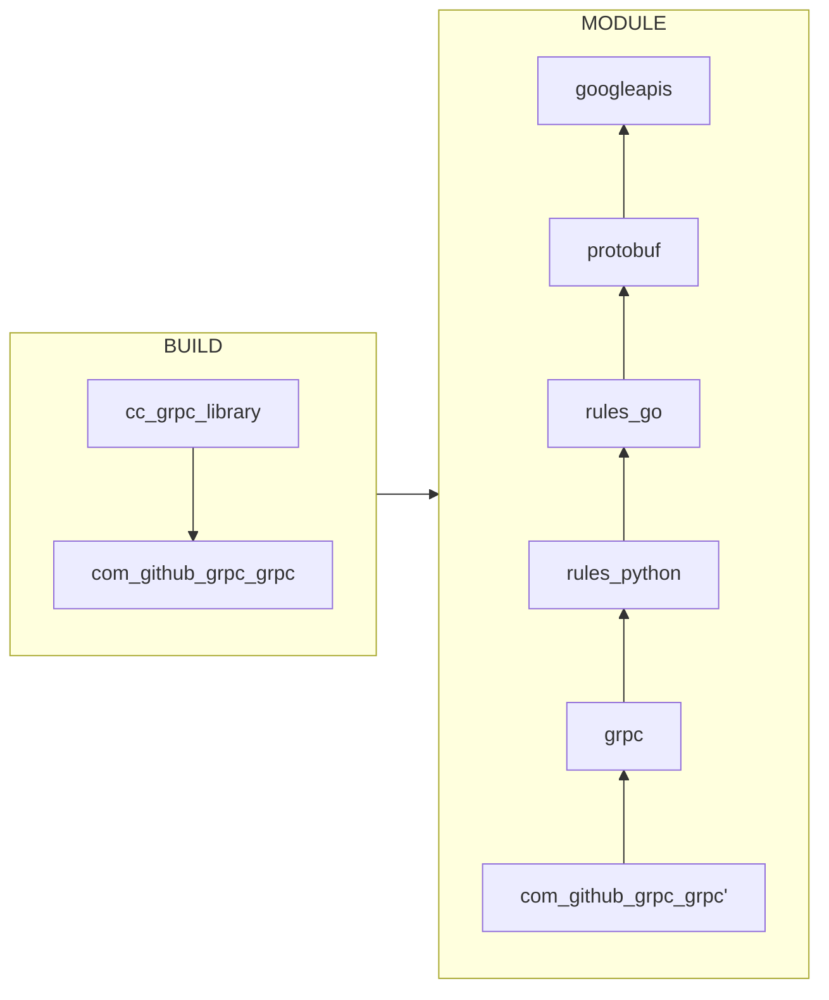
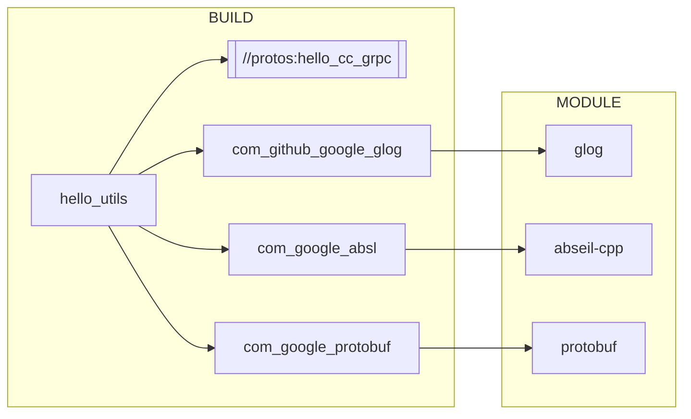
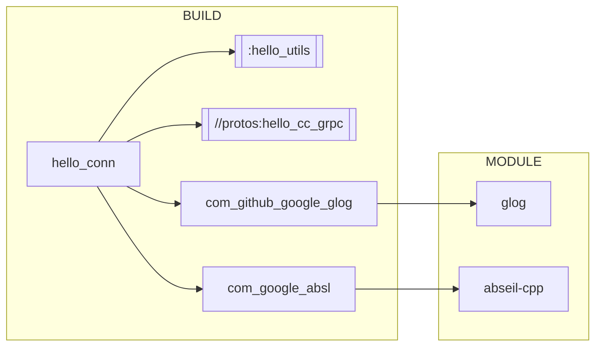
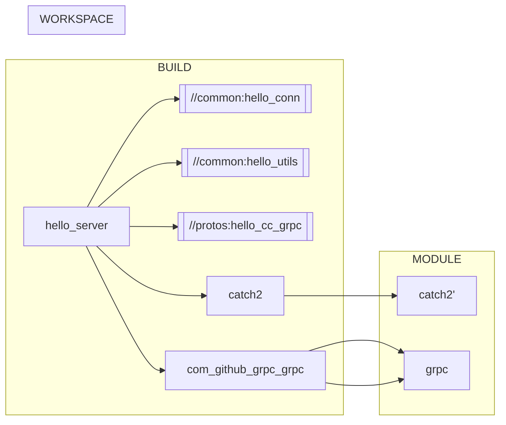

# grpc c++ demo

## 1 Setup

<https://bazel.build/>
<https://github.com/bazelbuild/bazel/releases>
<https://visualstudio.microsoft.com/downloads/>

### windows

<!-- bazel-7.3.2-windows-x86_64.zip -->

```sh
$ bazel --version
bazel 7.3.2
```

```sh
export BAZEL_VC="C:\Program Files\Microsoft Visual Studio\2022\Community\VC"
```

## 2 Build

<https://github.com/grpc/grpc/blob/master/BUILDING.md#build-from-source>

```sh
export proxy_port=56458
export http_proxy=127.0.0.1:$proxy_port
export https_proxy=127.0.0.1:$proxy_port
```

```sh
echo $https_proxy
```

```sh
$ sh cpu_core_num.sh 
CPU cores=16
```

### 2.1 build hello_cc_grpc

```sh
cd hello-grpc-cpp
bazel clean --expunge 
# hello_cc_grpc -> hello_cc_proto -> hello_proto
bazel build --jobs=32 ///protos:hello_cc_grpc
```

```sh
$ ls bazel-bin/protos/
_objs/             hello_cc_grpc.lib-2.params  landing.grpc.pb.h  landing.pb.h
hello_cc_grpc.lib  landing.grpc.pb.cc          landing.pb.cc
```

#### hello_cc_grpc dependencies

> <https://mermaid.js.org/syntax/flowchart.html>



### 2.2 build hello_utils

```sh
bazel build --compiler=$BAZEL_VC --jobs=32 ///common:hello_utils
```

#### hello_utils dependencies



### 2.3 build hello_conn

```sh
bazel build --compiler=$BAZEL_VC --jobs=32 ///common:hello_conn
```

#### hello_conn dependencies



### 2.4 build hello_server/client

```sh
export proxy_port=56458
export http_proxy=127.0.0.1:$proxy_port
export https_proxy=127.0.0.1:$proxy_port
```

```sh
bazel build --jobs=32  ///:hello_server ///:hello_client
```

#### hello_server/client dependencies



## 3 Run

```bash
sh server_start.sh
```

```bash
sh client_start.sh
```

## Build Error on Windows

```sh
ERROR: C:/users/feuye/_bazel_feuye/7zpmwd6n/external/grpc~~grpc_repo_deps_ext~envoy_api/envoy/extensions/load_balancing_policies/client_side_weighted_round_robin/v3/BUILD:7:18: Compiling external/grpc~~grpc_repo_deps_ext~envoy_api/envoy/extensions/load_balancing_policies/client_side_weighted_round_robin/v3/client_side_weighted_round_robin.upb_minitable.c failed: (Exit 2): cl.exe failed: error executing CppCompile command (from target @@grpc~~grpc_repo_deps_ext~envoy_api//envoy/extensions/load_balancing_policies/client_side_weighted_round_robin/v3:pkg) C:\Program Files\Microsoft Visual Studio\2022\Community\VC\Tools\MSVC\14.41.34120\bin\HostX64\x64\cl.exe ... (remaining 1 argument skipped)
Microsoft (R) C/C++ Optimizing Compiler Version 19.41.34120 for x64
Copyright (C) Microsoft Corporation.  All rights reserved.

cl : Command line error D8022 : cannot open 'bazel-out/x64_windows-fastbuild/bin/external/grpc~~grpc_repo_deps_ext~envoy_api/envoy/extensions/load_balancing_policies/client_side_weighted_round_robin/v3/_objs/pkg.upb_minitable/client_side_weighted_round_robin.upb_minitable.obj.params'

```