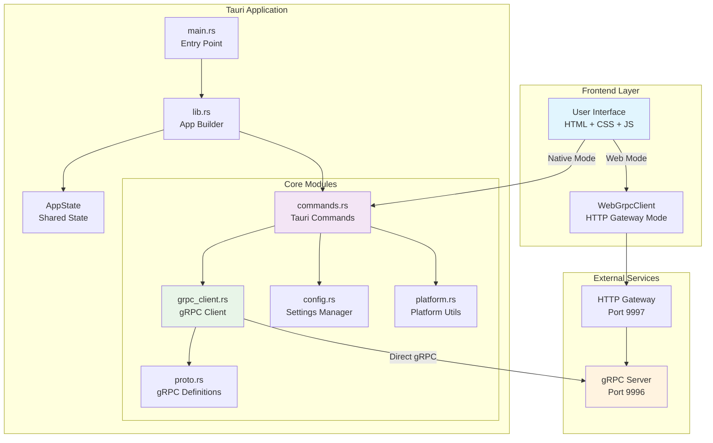
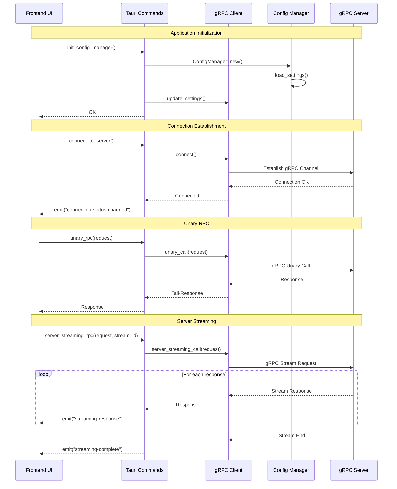

# Hello gRPC Tauri

A clean Tauri application demonstrating gRPC communication with both native desktop and web support.

## Features

- **Dual Mode Support**: Native desktop and web browser compatibility
- **Complete gRPC Implementation**: All four gRPC patterns (Unary, Server/Client/Bidirectional streaming)
- **Real-time Communication**: Live streaming responses with event-driven updates
- **Cross-platform**: Desktop (Windows, macOS, Linux) and web browsers
- **Configuration Persistence**: Automatic settings save/load with validation

## Architecture Overview



## Component Relationships

```mermaid
classDiagram
    class AppState {
        +grpc_client: SharedGrpcClient
        +config_manager: ConfigManager
        +new() AppState
    }

    class GrpcClient {
        +settings: ConnectionSettings
        +client: LandingServiceClient
        +connect() Result
        +unary_call() Result
        +server_streaming_call() Result
        +client_streaming_call() Result
        +bidirectional_streaming_call() Result
    }

    class ConfigManager {
        +app_handle: AppHandle
        +save_settings() Result
        +load_settings() Result
        +reset_settings() Result
    }

    class ConnectionSettings {
        +server: String
        +port: u16
        +use_tls: bool
        +timeout_seconds: u64
        +validate() Result
    }

    class WebGrpcClient {
        +baseUrl: String
        +talk() Promise
        +talkOneAnswerMore() AsyncGenerator
        +talkMoreAnswerOne() Promise
        +talkBidirectional() AsyncGenerator
    }

    class Commands {
        +init_config_manager()
        +connect_to_server()
        +unary_rpc()
        +server_streaming_rpc()
        +client_streaming_rpc()
        +bidirectional_streaming_rpc()
    }

    AppState --> GrpcClient
    AppState --> ConfigManager
    GrpcClient --> ConnectionSettings
    Commands --> AppState
    WebGrpcClient --> "HTTP Gateway"
    GrpcClient --> "gRPC Server"
```

## Communication Flow



## File Structure and Responsibilities

### Rust Backend (`src-tauri/src/`)

| File             | Purpose                                              | Key Components                                               |
| ---------------- | ---------------------------------------------------- | ------------------------------------------------------------ |
| `main.rs`        | Application entry point                              | `main()` function, Windows subsystem config                  |
| `lib.rs`         | Application builder and module orchestration         | Tauri app setup, plugin initialization, command registration |
| `commands.rs`    | Tauri command handlers (Frontend ↔ Backend bridge)   | All `#[tauri::command]` functions, event emission            |
| `grpc_client.rs` | gRPC client implementation and connection management | `GrpcClient`, `ConnectionSettings`, streaming handlers       |
| `config.rs`      | Configuration persistence and validation             | `ConfigManager`, settings storage via Tauri Store            |
| `platform.rs`    | Platform-specific utilities and error handling       | Platform detection, network validation, error mapping        |
| `proto.rs`       | gRPC protocol definitions                            | Generated protobuf code inclusion                            |

### Frontend (`src/`)

| File                         | Purpose                                  | Key Components                                    |
| ---------------------------- | ---------------------------------------- | ------------------------------------------------- |
| `main.js`                    | Main application logic and UI controller | Event handlers, mode detection, result formatting |
| `modules/web_grpc_client.js` | HTTP gateway client for web mode         | `WebGrpcClient` class, HTTP-to-gRPC translation   |
| `index.html`                 | Application UI structure                 | Material Design-inspired interface                |
| `styles.css`                 | Application styling                      | Responsive design, dark theme support             |

## Quick Start

### Desktop Application

```bash
npm install
npm run dev     # Development mode
npm run build   # Production build
```

### Web Application

```bash
npm run web     # Start HTTP server on port 8080
```

```bash
cargo tauri android dev
```

## Usage

1. **Configure Server**: Enter the gRPC server host and port (default: localhost:9996)
2. **Mode Selection**: Automatically detected (Native for desktop, Web for browsers)
3. **Test Connection**: Click "Test Connection" to execute all gRPC operation types
4. **View Results**: Real-time formatted responses with status indicators

## gRPC Operations Demonstrated

1. **Unary RPC**: Single request → Single response
2. **Server Streaming**: Single request → Multiple responses (stream)
3. **Client Streaming**: Multiple requests (stream) → Single response
4. **Bidirectional Streaming**: Multiple requests ↔ Multiple responses (dual streams)

Each operation is demonstrated with proper error handling, timeout management, and real-time progress updates.

```

Tauri App → Rust Backend → gRPC Server (port 9996)

```

### Web Mode

```

Web Browser → HTTP Gateway (port 9997) → gRPC Server (port 9996)

```

## Platform Support

- **Desktop**: Windows, macOS, Linux (via Tauri)
- **Web**: All modern browsers (via HTTP gateway)
- **Mobile**: Android, iOS (via Tauri mobile)

## Recommended IDE Setup

- [VS Code](https://code.visualstudio.com/) + [Tauri](https://marketplace.visualstudio.com/items?itemName=tauri-apps.tauri-vscode) + [rust-analyzer](https://marketplace.visualstudio.com/items?itemName=rust-lang.rust-analyzer)

```

```
