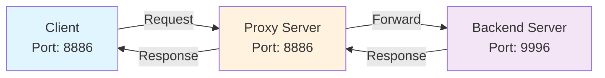
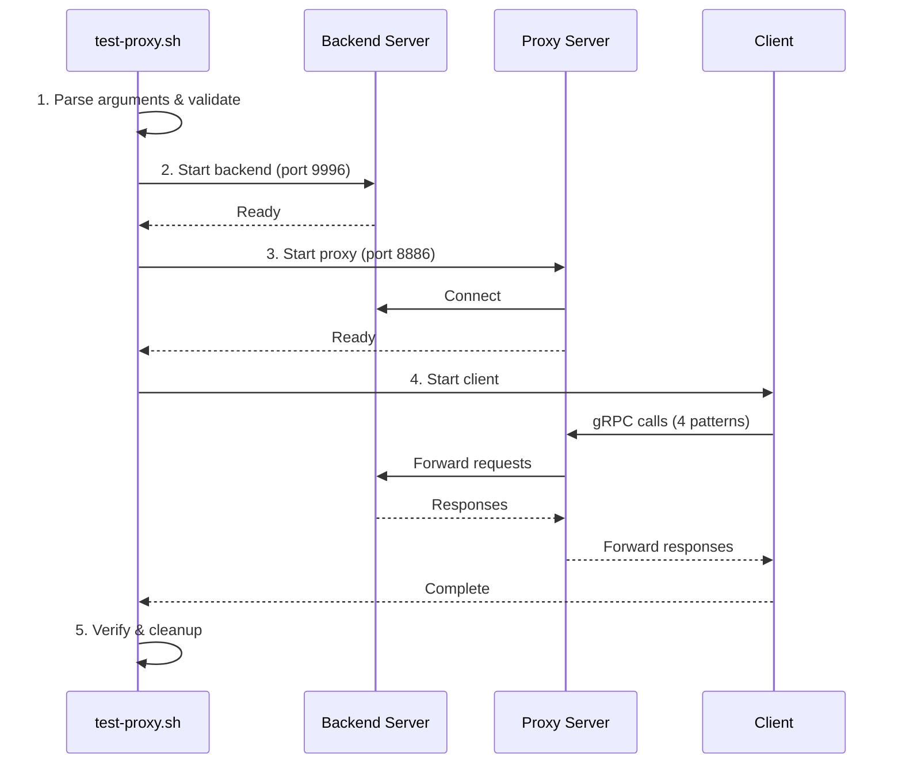

# Proxy Scripts

Unified scripts for testing gRPC proxy functionality across all 12 languages.

## Quick Start

```bash
# Test single language
./scripts/proxy/test-proxy.sh --language go

# Test all languages
./scripts/proxy/verify-all-proxies.sh

# With TLS
./scripts/proxy/test-proxy.sh --language java --tls
```

## Architecture



## Test Workflow



## Scripts

| Script | Purpose | Usage |
|:-------|:--------|:------|
| `test-proxy.sh` | Test single language | `--language <lang> [--tls] [--timeout <sec>]` |
| `verify-all-proxies.sh` | Test all languages | `[--tls] [--output <file>]` |
| `start-backend.sh` | Start backend server | `--language <lang> [--port <port>] [--tls]` |
| `start-proxy.sh` | Start proxy server | `--language <lang> [--port <port>] [--backend <host:port>] [--tls]` |
| `start-client.sh` | Start client | `--language <lang> [--server <host:port>] [--tls]` |

## Supported Languages

**All 12 languages support proxy mode (100%):**

✅ Java • Go • Python • Node.js • TypeScript • Rust • C++ • C# • Kotlin • Swift • Dart • PHP

## Environment Variables

| Variable | Purpose | Example |
|:---------|:--------|:--------|
| `GRPC_SERVER_PORT` | Server listen port | `9996`, `8886` |
| `GRPC_HELLO_BACKEND` | Backend host (proxy mode) | `localhost` |
| `GRPC_HELLO_BACKEND_PORT` | Backend port (proxy mode) | `9996` |
| `GRPC_HELLO_SECURE` | Enable TLS | `Y` |
| `GRPC_SERVER` | Server host (client) | `localhost` |

## Exit Codes

| Code | Meaning |
|:-----|:--------|
| `0` | Success |
| `1` | Invalid parameters |
| `2` | Environment error (missing files/certs) |
| `3` | Process failed to start |
| `4` | Communication failed |
| `5` | Timeout |

## Manual Testing

```bash
# Terminal 1: Backend
./scripts/proxy/start-backend.sh --language java

# Terminal 2: Proxy
./scripts/proxy/start-proxy.sh --language java

# Terminal 3: Client
./scripts/proxy/start-client.sh --language java
```

## TLS Setup

```bash
# Generate certificates
cd docker/tls
./generate_grpc_certs.ps1

# Test with TLS
./scripts/proxy/test-proxy.sh --language java --tls
```

## Troubleshooting

**Port in use:**
```bash
lsof -i :9996  # Find process
kill <PID>     # Kill it
```

**Language not built:**
```bash
cd hello-grpc-<language>
# Follow language-specific build instructions
```

**TLS errors:**
- Ensure certificates exist in `docker/tls/`
- Use `--tls` flag on all components or none

## Implementation Details

See [PROXY_STATUS.md](PROXY_STATUS.md) for implementation details and [common.sh](common.sh) for shared functions.

---

**Last Updated**: 2025-11-20
