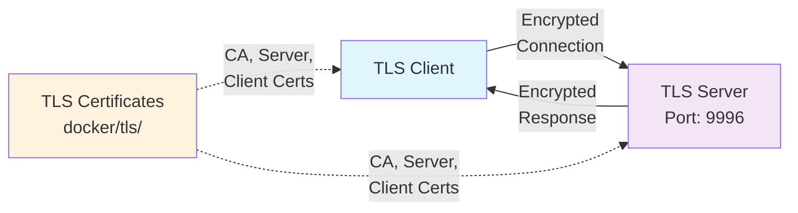
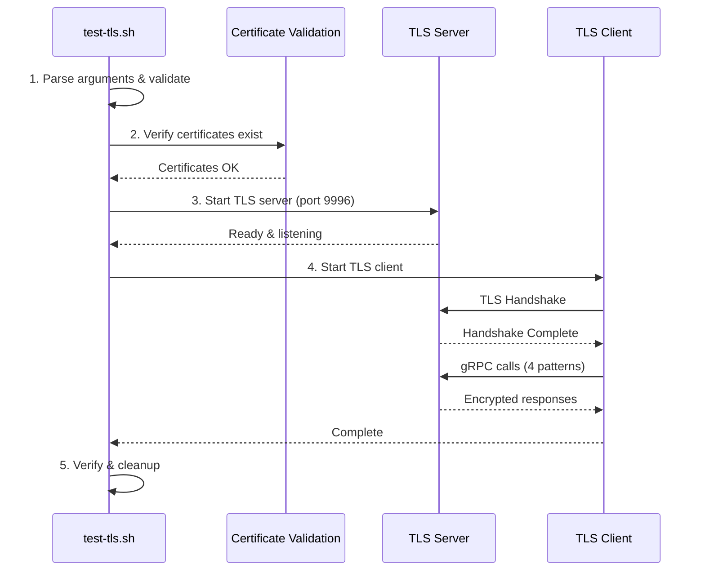

# TLS Verification Scripts

Unified scripts for testing TLS (Transport Layer Security) functionality across all 12 languages.

## Quick Start

```bash
# Test single language
./scripts/tls/test-tls.sh --language go

# Test all languages
./scripts/tls/verify-all-tls.sh

# Save report to file
./scripts/tls/verify-all-tls.sh --output tls-report.txt
```

## Architecture



## Test Workflow



## Scripts

| Script | Purpose | Usage |
|:-------|:--------|:------|
| `test-tls.sh` | Test single language | `--language <lang> [--timeout <sec>]` |
| `verify-all-tls.sh` | Test all languages | `[--output <file>]` |
| `start-tls-server.sh` | Start TLS server | `--language <lang> [--port <port>]` |
| `start-tls-client.sh` | Start TLS client | `--language <lang> [--server <host:port>]` |

## Supported Languages

**All 12 languages support TLS mode (100%):**

✅ Java • Go • Python • Node.js • TypeScript • Rust • C++ • C# • Kotlin • Swift • Dart • PHP

## Environment Variables

| Variable | Purpose | Example |
|:---------|:--------|:--------|
| `GRPC_SERVER_PORT` | Server listen port | `9996` |
| `GRPC_HELLO_SECURE` | Enable TLS | `Y` |
| `GRPC_SERVER` | Server host (client) | `localhost` |

## Exit Codes

| Code | Meaning |
|:-----|:--------|
| `0` | Success |
| `1` | Invalid parameters |
| `2` | Environment error (missing files/certs) |
| `3` | Process failed to start |
| `4` | Communication failed |
| `5` | Timeout |

## Manual Testing

```bash
# Terminal 1: Start TLS server
./scripts/tls/start-tls-server.sh --language java

# Terminal 2: Start TLS client
./scripts/tls/start-tls-client.sh --language java
```

## TLS Setup

### Certificate Generation

```bash
# Generate certificates (PowerShell)
cd docker/tls
./generate_grpc_certs.ps1
```

### Certificate Structure

```
docker/tls/
├── ca.crt                    # Certificate Authority certificate
├── ca.key                    # Certificate Authority private key
├── server_certs/
│   ├── server.crt           # Server certificate
│   └── server.key           # Server private key
└── client_certs/
    ├── client.crt           # Client certificate
    └── client.key           # Client private key
```

### Verification

All TLS scripts automatically verify that required certificates exist before starting tests. If certificates are missing, the script will provide guidance on generating them.

## Troubleshooting

### Port in use

```bash
# Find process using port 9996
lsof -i :9996

# Kill the process
kill <PID>
```

### Language not built

```bash
# Navigate to language directory
cd hello-grpc-<language>

# Follow language-specific build instructions
# See language README.md for details
```

### TLS certificate errors

**Missing certificates:**
```bash
# Generate certificates
cd docker/tls
./generate_grpc_certs.ps1
```

**Certificate verification failed:**
- Ensure all certificate files exist in `docker/tls/`
- Check file permissions (certificates must be readable)
- Verify certificate validity (not expired)

**TLS handshake failed:**
- Ensure both client and server use TLS mode (`GRPC_HELLO_SECURE=Y`)
- Verify server is using correct certificates
- Check that client trusts the CA certificate

### Test timeout

```bash
# Increase timeout (default: 30s)
./scripts/tls/test-tls.sh --language java --timeout 60
```

### Server fails to start

**Check logs:**
```bash
# Server logs are in /tmp/tls-server-*.log
cat /tmp/tls-server-*.log
```

**Common issues:**
- Port already in use (see "Port in use" above)
- Missing build artifacts (see "Language not built" above)
- Certificate path issues (ensure running from project root)

### Client connection failed

**Check server is running:**
```bash
# Verify server is listening
lsof -i :9996
```

**Check TLS configuration:**
- Ensure `GRPC_HELLO_SECURE=Y` is set for both client and server
- Verify client has access to certificates in `docker/tls/`

### All tests failing

**Verify environment:**
```bash
# Check certificates exist
ls -la docker/tls/ca.crt
ls -la docker/tls/server_certs/
ls -la docker/tls/client_certs/

# Check all languages are built
./scripts/tls/verify-all-tls.sh --output debug-report.txt
cat debug-report.txt
```

## Implementation Details

### Script Architecture

The TLS verification scripts follow the same architectural pattern as the proxy scripts:

- **Shared utilities**: Reuses `scripts/proxy/common.sh` for common functions
- **Consistent interface**: Same command-line argument patterns and exit codes
- **Modular design**: Separate scripts for testing, verification, and manual utilities

### Key Functions (from common.sh)

| Function | Purpose |
|:---------|:--------|
| `validate_language()` | Check if language is supported |
| `get_language_dir()` | Get directory name for language |
| `get_server_command()` | Get server start command with TLS flag |
| `get_client_command()` | Get client start command with TLS flag |
| `wait_for_ready()` | Wait for port to be listening |
| `kill_process_gracefully()` | Terminate process gracefully |
| `log()` | Log messages with timestamps |

### TLS Configuration

Each language implementation supports TLS through the `GRPC_HELLO_SECURE=Y` environment variable. When enabled:

1. Server loads certificates from `docker/tls/server_certs/`
2. Client loads certificates from `docker/tls/client_certs/`
3. Both use CA certificate from `docker/tls/ca.crt` for verification
4. All gRPC communication is encrypted using TLS 1.2 or higher

### Test Execution

**Single language test (`test-tls.sh`):**
1. Parse and validate arguments
2. Verify all required certificates exist
3. Start TLS-enabled server on port 9996
4. Wait for server to be ready (with timeout)
5. Start TLS-enabled client
6. Verify all four gRPC patterns execute successfully
7. Cleanup processes and report results

**All languages test (`verify-all-tls.sh`):**
1. Parse arguments
2. Iterate through all 12 supported languages
3. Execute `test-tls.sh` for each language sequentially
4. Capture results (pass/fail/skip) and duration
5. Generate comprehensive report with statistics
6. Exit with code 0 if all passed, 2 if any failed

### Process Management

- All spawned processes are tracked for cleanup
- Signal handlers (EXIT, INT, TERM) ensure cleanup on interruption
- Graceful termination: SIGTERM first, then SIGKILL if needed
- Timeout enforcement on all wait operations

## Examples

### Test specific language

```bash
# Test Java TLS
./scripts/tls/test-tls.sh --language java

# Test Go TLS with custom timeout
./scripts/tls/test-tls.sh --language go --timeout 60

# Test Python TLS
./scripts/tls/test-tls.sh --language python
```

### Test all languages

```bash
# Test all and display report
./scripts/tls/verify-all-tls.sh

# Test all and save report
./scripts/tls/verify-all-tls.sh --output tls-verification-report.txt

# View saved report
cat tls-verification-report.txt
```

### Manual testing workflow

```bash
# Terminal 1: Start server
./scripts/tls/start-tls-server.sh --language java

# Terminal 2: Start client (in another terminal)
./scripts/tls/start-tls-client.sh --language java

# Terminal 1: Stop server with Ctrl+C
```

### Custom port testing

```bash
# Terminal 1: Start server on custom port
./scripts/tls/start-tls-server.sh --language go --port 9997

# Terminal 2: Connect client to custom port
./scripts/tls/start-tls-client.sh --language go --server localhost:9997
```

## Comparison with Proxy Scripts

| Feature | TLS Scripts | Proxy Scripts |
|:--------|:------------|:--------------|
| **Purpose** | Verify TLS encryption | Verify proxy forwarding |
| **Components** | Client → Server | Client → Proxy → Backend |
| **Ports** | 9996 (server) | 8886 (proxy), 9996 (backend) |
| **TLS Support** | Required | Optional (--tls flag) |
| **Certificates** | Always verified | Only with --tls flag |
| **Test Focus** | Encryption & handshake | Request forwarding |

## Related Documentation

- **Proxy Scripts**: `scripts/proxy/README.md` - Proxy functionality testing
- **Certificate Generation**: `docker/tls/generate_grpc_certs.ps1` - TLS certificate creation
- **Project README**: `README.md` - Overall project documentation

---

**Last Updated**: 2025-11-20
